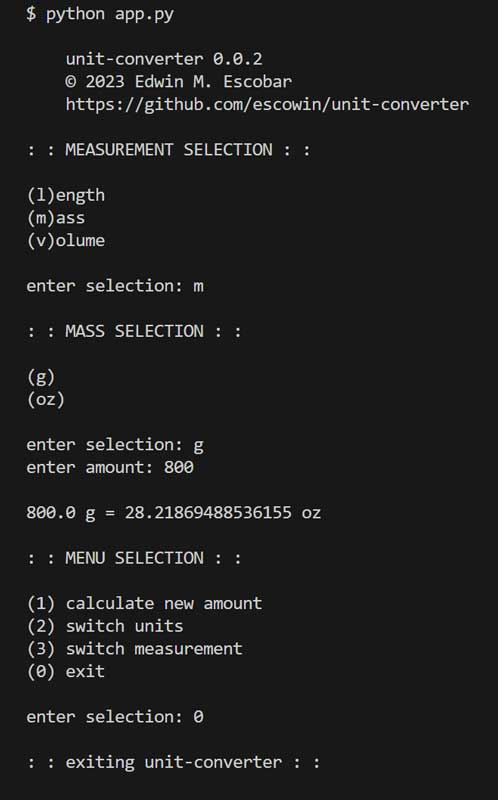

# unit-converter

## Description
[Repo](https://github.com/escowin/unit-converter) 

__unit_converter__ __v. 0.0.2__ interacts dynamically with user through the terminal. Its functionality relies on built-in & custom functions to handle data type conversions, math, concatenation, loops, and conditions.

This application serves as a stepping stone for Python proficiency. Future iterations of this application will expand into a full-stack development model, transitioning from a server-based architecture to a comprehensive integration with databases and client-side interfaces. Comprehension of Python's fundamental concepts, programming paradigms, and the utilization of various frameworks will be documented through the repository's pseudocode, commit history, and workflow.

Coming from a JavaScript background, my exploration of Python has reinforced fundamental programming principles. Despite visual syntax differences, the core concepts remain similar, enabling seamless adaptation and underscoring the versatility of my coding skills across languages.


## Table of Contents
- [Installation](#installation)
<!-- - [Test](#test) -->
- [Usage](#usage)
- [Features](#features)
- [Credits](#credits)
- [Author](#author)

## Installation
Run the following command to install the repository:
```
git clone git@github.com:escowin/unit-converter.git
```

<!-- ## Test
Run the following command to run tests:
```
$ python3 app.py
``` -->

## Usage
Run the following command to run the app:
```
python app.py
```



## Features
- Choose from various physical measurements such as mass, length, and volume.
- Converts between different units of measurements.

## Credits
- Languages: Python

## Author
### Edwin Escobar
- [Email](mailto:edwin@escowinart.com)
- [GitHub](https://github.com/escowin)
